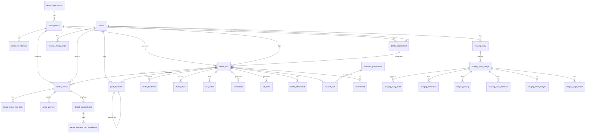

# Domain Model — Dental Modules

**Version:** 1.0  
**Branch:** feat/v1.5-g1-foundation  
**Last updated:** 2026-05-21

---

## Overview

Dentalemon ships ten dental domain modules layered on top of the Monobase platform primitives (`person`, `patient`, `booking`, `billing`, `audit`, `notifs`, `comms`, `storage`, `email`, `reviews`). Each module follows the vertical-slice pattern: one handler directory, one or more Drizzle schema files, repository classes, and route definitions, all independently deployable.

The ten modules are:

| # | Handler directory | Domain concern |
|---|-------------------|----------------|
| 1 | `dental-org` | Organizations, clinic branches, staff memberships |
| 2 | `dental-patient` | Dental-specific patient extensions on the base `patient` table |
| 3 | `dental-visit` | In-clinic encounter state, tooth charting, treatment recording |
| 4 | `dental-scheduling` | Appointment booking and lifecycle |
| 5 | `dental-billing` | Invoices, payments, payment plans |
| 6 | `dental-clinical` | Prescriptions, lab orders, consent forms, attachments, medical history, amendments |
| 7 | `dental-imaging` | Radiographic study management, annotations, findings, cephalometric analysis |
| 8 | `dental-pmd` | Immutable patient medical documents (signed visit snapshots + imports) |
| 9 | `dental-emr` | SOAP-style telemedicine / walk-in consultation notes |
| 10 | `dental-treatment` | _(Treatment entities live inside `dental-visit/repos/`; see note below)_ |

> **Note on dental-treatment:** There is a `dental-treatment` handler directory, but its schema file is minimal (a thin re-export). The canonical treatment tables (`dental_treatment`, `dental_treatment_template`, `treatment_plan_version`, `dental_chart`, `visit_notes`, `visit_note_version`) all reside in `dental-visit/repos/` and are tightly coupled to the visit lifecycle. The ten-module count above treats `dental-visit` as encompassing treatment management.

All dental modules import shared primitives from the base handlers:
- `handlers/patient/repos/patient.schema.ts` → `patient` table (Monobase core, extended by dental-patient)
- `handlers/person/repos/person.schema.ts` → `person` table (identity + PII)
- `handlers/dental-org/repos/branch.schema.ts` + `membership.schema.ts` → used as FKs across nearly every dental module

---

## Module → DB Table Mapping

### dental-org

| Module | Primary Table(s) | Key Columns | Notes |
|--------|-----------------|-------------|-------|
| dental-org | `dental_organization` | `id`, `owner_person_id`, `name`, `tier` (solo/clinic/group/enterprise), `imaging_tier`, `country_code` | Root org — all branches belong to one org |
| dental-org | `dental_branch` | `id`, `organization_id`, `name`, `address`, `city`, `timezone`, `working_hours` (jsonb) | Clinic location; FKed by every other dental table |
| dental-org | `dental_membership` | `id`, `branch_id`, `person_id` (nullable), `display_name`, `role`, `pin_hash`, `status` | Staff record; `person_id` is nullable for PIN-only staff |
| dental-org | `dental_consent_template` | `id`, `branch_id`, `name`, `body`, `requires_witness_signature`, `active` | Reusable consent form blueprints |

### dental-patient

The dental-patient module extends the Monobase `patient` table rather than creating a separate table. Extensions added directly to `patient`:

| Module | Primary Table(s) | Key Columns | Notes |
|--------|-----------------|-------------|-------|
| dental-patient | `patient` (extended) | `person_id`, `preferred_branch_id`, `dental_history_summary`, `needs_follow_up`, `has_active_payment_plan`, `status`, `recall_date`, `recall_note`, `follow_up_notes` (jsonb[]), `emergency_contact` (jsonb), `communication_preferences` (jsonb) | Monobase core table enriched with dental fields; `person_id` → `person.id` (cascade) |

### dental-visit

| Module | Primary Table(s) | Key Columns | Notes |
|--------|-----------------|-------------|-------|
| dental-visit | `dental_visit` | `id`, `patient_id`, `branch_id`, `dentist_member_id`, `status` (draft/active/completed/locked/discarded), `chief_complaint` | One active visit per patient enforced via partial unique index |
| dental-visit | `dental_treatment` | `id`, `visit_id`, `patient_id`, `tooth_number`, `surfaces` (jsonb), `cdt_code`, `description`, `status` (diagnosed/planned/performed/verified/dismissed/declined), `price_cents`, `carried_over`, `source_visit_id` | Treatment lifecycle with carry-over support |
| dental-visit | `dental_chart` | `id`, `visit_id`, `patient_id`, `teeth` (jsonb — `ToothChartState[]`) | One chart per visit; full tooth state snapshot |
| dental-visit | `visit_notes` | `id`, `visit_id`, `patient_id`, `dentist_member_id`, `subjective`, `objective`, `assessment`, `plan`, `notes`, `signed`, `signed_at`, `signed_by` | SOAP notes; signed = locked |
| dental-visit | `visit_note_version` | `id`, `note_id`, `version`, `content` (versionedSnapshotFields) | Append-only version history for visit notes |
| dental-visit | `dental_treatment_template` | `id`, `branch_id`, `name`, `description`, `items` (jsonb — `TemplateTreatmentItem[]`), `active` | Reusable treatment bundles for a branch |
| dental-visit | `treatment_plan_version` | `id`, `patient_id`, `version`, `content` (versionedSnapshotFields) | Immutable snapshot of accepted treatment plan |

### dental-scheduling

| Module | Primary Table(s) | Key Columns | Notes |
|--------|-----------------|-------------|-------|
| dental-scheduling | `dental_appointment` | `id`, `patient_id`, `dentist_member_id`, `branch_id`, `scheduled_at`, `duration_minutes`, `status` (scheduled/checked_in/completed/cancelled/no_show), `visit_id` (nullable), `notes`, `cancelled_at`, `cancellation_reason` | `visit_id` is populated when appointment converts to visit |

### dental-billing

| Module | Primary Table(s) | Key Columns | Notes |
|--------|-----------------|-------------|-------|
| dental-billing | `dental_invoice` | `id`, `visit_id`, `patient_id`, `branch_id`, `dentist_member_id`, `invoice_number`, `status` (draft/issued/partial/paid/overdue/voided), `subtotal_cents`, `discount_cents`, `tax_cents`, `total_cents`, `balance_cents`, `due_date` | One invoice per visit (optional) |
| dental-billing | `dental_invoice_line_item` | `id`, `invoice_id`, `treatment_id` (nullable), `cdt_code`, `description`, `tooth_number`, `unit_price_cents`, `quantity`, `amount_cents`, `is_done` | Line items derived from performed treatments |
| dental-billing | `dental_payment` | `id`, `invoice_id`, `patient_id`, `branch_id`, `amount_cents`, `method`, `receipt_number`, `recorded_by_member_id`, `is_void` | Individual payment against an invoice |
| dental-billing | `dental_payment_plan` | `id`, `invoice_id`, `patient_id`, `total_cents`, `number_of_installments`, `frequency`, `start_date`, `status` (on_track/behind/completed/defaulted) | Installment plan for an invoice |
| dental-billing | `dental_payment_plan_installment` | `id`, `plan_id`, `installment_number`, `amount_cents`, `paid_cents`, `paid_date`, `payment_id`, `status` (pending/paid/overdue/waived) | Individual installment within a plan |

### dental-clinical

| Module | Primary Table(s) | Key Columns | Notes |
|--------|-----------------|-------------|-------|
| dental-clinical | `prescription` | `id`, `visit_id`, `patient_id`, `prescriber_member_id`, `rx_norm_code`, `drug_name`, `dosage`, `frequency`, `duration`, `quantity`, `instructions`, `dispense_as_written` | RxNorm-coded medications |
| dental-clinical | `medical_history_entry` | `id`, `patient_id`, `entry_type` (condition/medication/allergy/procedure/vaccination/family_history), `code_system`, `code`, `display_name`, `notes`, `onset_date`, `resolved_date`, `active` | ICD-10 / RxNorm / SNOMED CT coded entries |
| dental-clinical | `lab_order` | `id`, `visit_id`, `patient_id`, `lab_name`, `description`, `status` (ordered/in_fabrication/delivered/fitted/cancelled), `ordered_at`, `expected_delivery_date`, `replaced_by_order_id` | Lab/prosthetics orders with self-referential replacement FK |
| dental-clinical | `dental_attachment` | `id`, `visit_id`, `patient_id`, `image_type` (xray/photo/scan/document/other), `tooth_numbers` (jsonb), `file_name`, `file_path`, `file_size_bytes`, `mime_type`, `deleted_at` | Binary file references (stored in S3/MinIO) |
| dental-clinical | `consent_form` | `id`, `visit_id`, `patient_id`, `template_id`, `template_name`, `signed`, `signed_at`, `signature_data`, `accepted_plan_version_id` | Signed consent; links to treatment plan version |
| dental-clinical | `amendment` | `id`, `visit_id`, `patient_id`, `author_member_id`, `original_record_type`, `original_record_id`, `reason`, `content` | Additive-only corrections; never mutates original record |

### dental-imaging

| Module | Primary Table(s) | Key Columns | Notes |
|--------|-----------------|-------------|-------|
| dental-imaging | `imaging_study` | `id`, `patient_id`, `visit_id` (nullable), `branch_id`, `acquired_by`, `modality` (periapical/bitewing/panoramic/cephalometric/cbct/other), `status` (active/archived) | Study-level record for one upload session |
| dental-imaging | `imaging_study_image` | `id`, `study_id`, `storage_key`, `pixel_spacing_mm`, `sequence_number`, `dicom_metadata` (jsonb), `modality`, `status` | Individual image file within a study |
| dental-imaging | `imaging_study_tooth` | `id`, `image_id`, `tooth_number`, `numbering_system` | JOIN table — image → tooth numbers |
| dental-imaging | `imaging_annotation` | `id`, `image_id`, `type` (line/angle/area/label/arrow/freehand/shape/tooth), `geometry` (jsonb), `measurement_value`, `measurement_unit`, `tooth_number`, `visible` | Per-image geometric annotations |
| dental-imaging | `imaging_finding` | `id`, `image_id`, `annotation_id` (nullable), `treatment_id` (loose FK — no constraint), `visit_id`, `patient_id`, `branch_id`, `type` (caries/bone_loss/etc.), `status` (suspected/confirmed/monitoring/resolved), `tooth_number`, `surfaces` (jsonb), `note` | Structured radiographic finding |
| dental-imaging | `imaging_ceph_landmark` | `id`, `image_id`, `landmark_code`, `x`, `y`, `source` (manual/auto/imported), `confidence`, `status` (placed/confirmed/rejected) | Image-space pixel coordinates (not screen-space) |
| dental-imaging | `imaging_ceph_analysis` | `id`, `image_id`, `analysis_type`, `measurements` (jsonb), `calibration_value`, `calibration_method`, `calibrated_at`, `calibrated_by` | Computed cephalometric measurements |
| dental-imaging | `imaging_ceph_report` | `id`, `image_id`, `version`, `content` (versionedSnapshotFields) | Immutable append-only analysis snapshots |

### dental-pmd

| Module | Primary Table(s) | Key Columns | Notes |
|--------|-----------------|-------------|-------|
| dental-pmd | `pmd_document` | `id`, `visit_id`, `patient_id`, `author_member_id`, `branch_id`, `status` (generated/signed/superseded), `content` (JSON snapshot), `signature`, `signed_at`, `supersedes_id` (self-ref), `checksum` (SHA-256) | Immutable medico-legal record; self-referential chain via `supersedes_id` |
| dental-pmd | `imported_pmd` | `id`, `patient_id`, `source_facility`, `source_reference`, `content`, `imported_at`, `safety_floor_merged` | External PMDs from other facilities |

### dental-emr

| Module | Primary Table(s) | Key Columns | Notes |
|--------|-----------------|-------------|-------|
| dental-emr | `consultation_note` | `id`, `patient_id`, `provider_id`, `context` (varchar 255 — idempotency key), `chief_complaint`, `assessment`, `plan`, `vitals` (jsonb), `symptoms` (jsonb), `prescriptions` (jsonb), `follow_up` (jsonb), `external_documentation` (jsonb), `status` (draft/finalized/amended), `finalized_at`, `finalized_by`, `tenant_id` (nullable) | SOAP-style telehealth encounter; separate from in-clinic `dental_visit` |

---

## Entity Relationship Summary



---

## FHIR R4 Alignment

| Dental Entity | FHIR R4 Resource | Mapping Notes | Divergences |
|---------------|-----------------|---------------|-------------|
| `patient` (extended) | `Patient` | `person_id` → FHIR `Patient.link` to upstream identity; `emergency_contact` → `Patient.contact`; `communication_preferences` → `Patient.communication` | No FHIR `identifier` slice for dental record number; recall date is a plain ISO string rather than a `Patient.contact.period` |
| `dental_organization` | `Organization` | `tier` → `Organization.type` coding; `owner_person_id` → `Organization.contact` | `imaging_tier` is platform-specific; no FHIR equivalent |
| `dental_branch` | `Location` | `address`/`city`/`timezone` → `Location.address`; `working_hours` (jsonb) → `Location.hoursOfOperation` | Custom jsonb shape rather than FHIR `Location.hoursOfOperation` repetitions |
| `dental_membership` | `PractitionerRole` + `Practitioner` | `display_name` → `Practitioner.name`; `role` enum → `PractitionerRole.code`; `branch_id` → `PractitionerRole.location` | PIN-only staff (null `person_id`) have no corresponding FHIR `Practitioner.identifier`; PIN auth is non-FHIR |
| `dental_visit` | `Encounter` | `status` maps: draft→planned, active→in-progress, completed→finished, locked→finished, discarded→cancelled; `chief_complaint` → `Encounter.reasonCode` | No FHIR `Encounter.class` coded value; `dentist_member_id` maps to `Encounter.participant` |
| `dental_appointment` | `Appointment` | `scheduled_at` + `duration_minutes` → `Appointment.start/end`; `status` maps: scheduled→booked, checked_in→arrived, completed→fulfilled, cancelled→cancelled, no_show→noshow | `visit_id` linkage to converted encounter is non-FHIR; no `Appointment.slot` resource |
| `dental_treatment` | `Procedure` + `ServiceRequest` | Diagnosed/planned treatments → `ServiceRequest`; performed/verified → `Procedure`; `cdt_code` → `Procedure.code` (CDT system) | Dual-state nature (plan→procedure) requires two FHIR resources; `carried_over` flag is platform-specific |
| `dental_invoice` | `Invoice` + `Claim` | `invoice_number` → `Invoice.identifier`; line items → `Invoice.lineItem`; `status` → `Invoice.status` | `Claim` would be used for insurance submission, but Dentalemon targets self-pay; `discount_cents` not in FHIR Invoice natively |
| `dental_invoice_line_item` | `Invoice.lineItem` (inline) | `cdt_code` → `Invoice.lineItem.chargeItemCodeableConcept`; `unit_price_cents` → `Invoice.lineItem.priceComponent` | FHIR represents line items as nested structures; Dentalemon uses a separate table for query efficiency |
| `dental_payment` | `PaymentReconciliation` | `receipt_number` → `PaymentReconciliation.identifier`; `method` → `PaymentReconciliation.paymentNote` | FHIR does not have a first-class Payment resource in R4; void pattern (`is_void`) is non-standard |
| `dental_payment_plan` | _(no direct FHIR R4 equivalent)_ | Closest is `Contract` with payment schedule; `installment` maps to `Contract.term.offer` | FHIR R4 has no installment billing resource; this is a Dentalemon-specific construct |
| `prescription` | `MedicationRequest` | `rx_norm_code` → `MedicationRequest.medicationCodeableConcept` (RxNorm system); `drug_name` → display; `frequency`/`dosage` → `MedicationRequest.dosageInstruction`; `dispense_as_written` → `MedicationRequest.substitution.allowed` | Visit-scoped (no standalone prescriptions); no `MedicationRequest.requester` device support |
| `medical_history_entry` | `Condition` / `AllergyIntolerance` / `Procedure` / `Immunization` | `entry_type` determines FHIR resource: condition→Condition, allergy→AllergyIntolerance, procedure→Procedure, vaccination→Immunization, medication→MedicationStatement | Unified single-table design vs. FHIR's separate resources per clinical concept |
| `lab_order` | `ServiceRequest` | `lab_name` → `ServiceRequest.performer` reference; `status` maps: ordered→active, in_fabrication→active, delivered→completed, fitted→completed, cancelled→revoked | `replaced_by_order_id` (self-ref) has no FHIR ServiceRequest equivalent |
| `dental_attachment` | `DocumentReference` / `Media` | `image_type=xray|photo|scan` → `Media`; `image_type=document` → `DocumentReference`; `file_path` → `Media.content.url`; `tooth_numbers` → extension | No FHIR tooth numbering coding system enforced; uses FDI/UNS integers |
| `consent_form` | `Consent` | `signed` → `Consent.status=active`; `signed_at` → `Consent.dateTime`; `template_id` → `Consent.policy.uri`; `accepted_plan_version_id` → `Consent.provision` | Signature stored as base64 text rather than FHIR `Consent.verification`; template system is platform-specific |
| `imaging_study` + `imaging_study_image` | `ImagingStudy` | Study→`ImagingStudy`; images→`ImagingStudy.series.instance`; `modality` enum → DICOM modality code (RG, DX, CR, CT, etc.) | Storage uses S3 (not DICOMweb); `dicom_metadata` is raw jsonb rather than typed DICOM attributes |
| `imaging_finding` | `Observation` | `type` → `Observation.code` (SNOMED CT tooth finding); `status` → `Observation.status`; `tooth_number` + `surfaces` → body site extension | Finding-to-treatment link (`treatment_id`) is a loose UUID FK with no FHIR Observation.hasMember linkage |
| `imaging_ceph_landmark` | `Observation` (imaging sub-type) | `landmark_code` → `Observation.component.code` (cephalometric landmark coding); `x/y` → `Observation.component.valueQuantity` | Image-space pixel coordinates rather than anatomical coordinates; no standard FHIR ceph landmark value set |
| `imaging_ceph_analysis` | `Observation` (derived measurement) | `analysis_type` → `Observation.code`; `measurements` (jsonb) → `Observation.component[]`; `calibration_method` → `Observation.method` | Custom calibration provenance fields have no FHIR equivalent; `imaging_ceph_report` (versioned snapshots) → `DiagnosticReport` |
| `pmd_document` | `DocumentReference` + `DiagnosticReport` | `content` (signed JSON snapshot) → `DocumentReference.content.attachment`; `checksum` → `DocumentReference.content.attachment.hash`; `supersedes_id` chain → `DocumentReference.relatesTo` with `replaces` code | Digital signature stored as base64 text rather than FHIR `Provenance` resource; `imported_pmd` has no FHIR equivalent |
| `consultation_note` | `Encounter` + `ClinicalImpression` | EMR context → `Encounter`; SOAP fields → `ClinicalImpression` (assessment/plan) + `Observation` (vitals); `status` → `ClinicalImpression.status`; `context` (idempotency key) is non-FHIR | Prescriptions stored as JSONB array rather than linked `MedicationRequest` resources; `external_documentation` is platform-specific |

---

## Cross-Module Dependencies

The table below shows which handler modules import schema definitions from other dental modules (import arrows = "depends on").

```
dental-org           ← (no dental imports — root anchor)
dental-patient       ← person (Monobase core)
dental-visit         ← dental-org (branch, membership), patient
dental-scheduling    ← dental-org (branch, membership), patient, dental-visit
dental-billing       ← dental-org (branch, membership), patient, dental-visit (visit, treatment)
dental-clinical      ← dental-org (membership), patient, dental-visit (visit, treatment-plan-version)
dental-imaging       ← dental-org (branch), patient, dental-visit (visit)
dental-pmd           ← dental-org (branch, membership), patient, dental-visit
dental-emr           ← patient, provider (Monobase core)
```

**Dependency direction summary:**

- `dental-org` is the root anchor — all other dental modules import branch and/or membership from it.
- `patient` (Monobase core) is a second root — all clinical modules reference it.
- `dental-visit` is the central hub — billing, clinical, imaging, and pmd all depend on it.
- `dental-emr` is deliberately isolated from `dental-visit` (different workflow: telehealth vs. in-clinic).
- No circular imports detected.

**Potential coupling risks:**

- `dental-billing` imports `dental-visit`'s treatment schema directly (for line-item foreign keys). If treatment table names change, billing migrations must follow.
- `dental-clinical`'s `consent_form` imports `treatment_plan_version` from `dental-visit` — a cross-module schema import that creates implicit versioning coupling.
- `dental-imaging`'s `imaging_finding` imports `dentalVisits` from `dental-visit` and `dentalBranches` from `dental-org` to establish typed FK constraints, despite `treatment_id` being a deliberately loose FK (see below).

---

## Loose-Coupling Boundaries

Several FK relationships are stored as plain UUIDs without a Drizzle `.references()` constraint. This is intentional — it prevents DB-level circular dependencies and allows cross-module records to be deleted independently.

| Table | Column | References (logically) | Why loose |
|-------|--------|----------------------|-----------|
| `imaging_finding` | `treatment_id` | `dental_treatment.id` | Treatment lives in `dental-visit`; cascade-deleting a finding when a treatment is removed would be semantically wrong (findings are radiographic evidence, not treatment artefacts). Resolved by application-layer soft links only. |
| `dental_treatment` | `source_visit_id` | `dental_visit.id` (self-referential visit) | Carry-over treatments reference the originating visit; that visit may be archived or locked. Loose FK avoids cascade complications on old locked visits. |
| `dental_invoice` | `visit_id` | `dental_visit.id` | Invoices can exist without a visit (standalone/corrective). Making the FK nullable without a DB constraint keeps billing independent of visit lifecycle. |
| `dental_consent_template` | `branch_id` (no `.references()`) | `dental_branch.id` | Consent templates are branch-scoped but template body must survive branch archival. Application-level filtering enforces isolation. |
| `dental_treatment_template` | `branch_id` (no `.references()`) | `dental_branch.id` | Same rationale as consent templates — template definitions outlive individual branch records. |
| `consultation_note` | `tenant_id` | _(cadence scope)_ | Nullable by design; PHI isolation is enforced by cadence P2P sync scope claims, not a DB FK. No NOT-NULL migration is planned. |

**General principle:** FK constraints are enforced at the DB level when cascade-delete semantics are correct and the parent will never be archived independently. Where one side is a long-lived or platform-managed entity (branch, visit-as-archive, treatment) and the child record has independent audit value, the FK is kept loose and referential integrity is enforced at the application layer.
